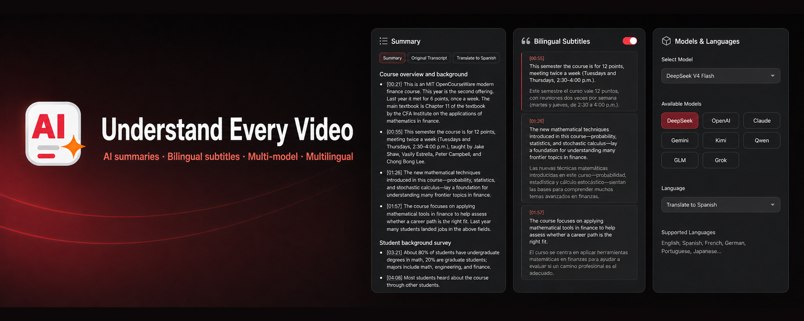
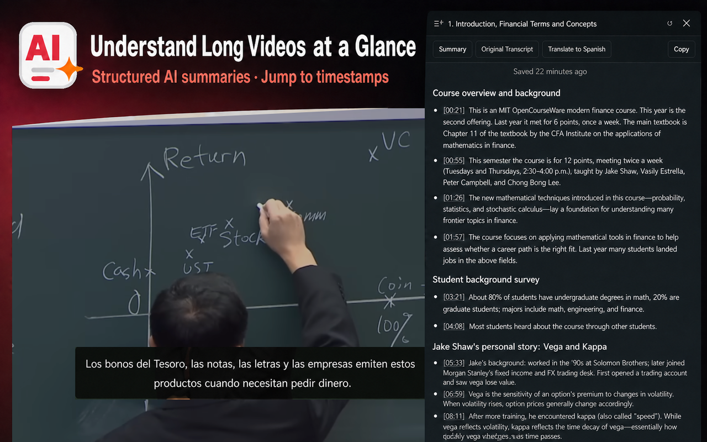
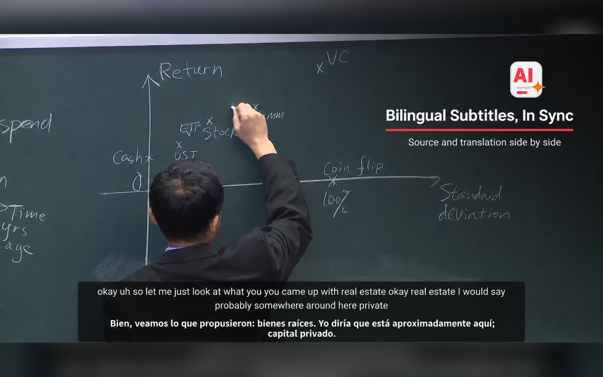
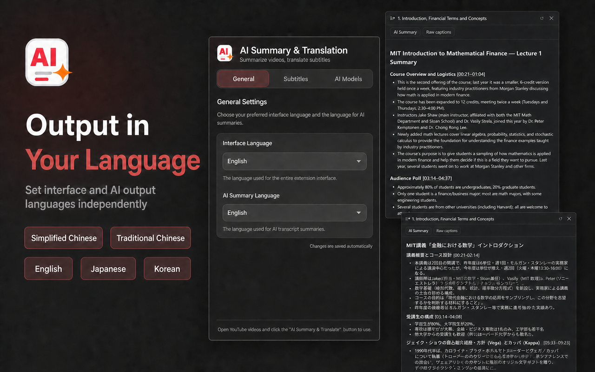
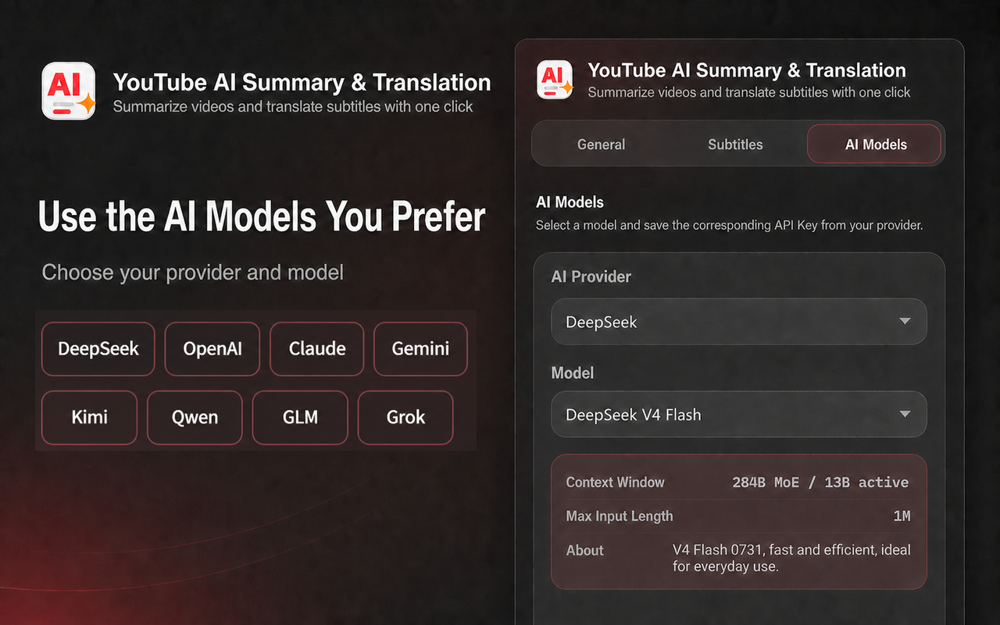

# YouTube AI Summary & Translation

> [简体中文](README.md) | English

A Chrome extension for YouTube. Use your own AI API key to summarize videos, read and translate captions, and display synchronized bilingual subtitles in the player.

## Preview



<p align="center">
  
  
</p>

<p align="center">
  
  
</p>

## Key Features

### AI Video Summaries

- Generate structured video summaries with one click
- Watch summaries appear in real time without waiting for the entire response
- Support for Simplified Chinese, Traditional Chinese, English, Japanese, Korean, Spanish, French, and German
- Summaries are saved locally for convenient access when you revisit the same video

### Read and Translate Captions

- View the video's complete captions in the side panel
- Click a caption timestamp to jump directly to that point in the video
- Translate individual sections or continue translating the full transcript from your current progress
- Switch between the original text and translation at any time

### In-Player Bilingual Subtitles

- Display the original text and translation together inside the YouTube player
- Keep subtitles synchronized with the video in standard, fullscreen, and theater modes
- Select and copy subtitle text directly
- Automatically pre-translate upcoming content and resume from the new position after seeking
- In Learning Mode, show translations only when you hover over the subtitles

### Multiple AI Providers

DeepSeek, OpenAI, Anthropic Claude, Google Gemini, Moonshot Kimi, Tongyi Qwen, Zhipu GLM, and xAI Grok are supported, with model switching available in the extension settings.

You only need to configure an API key from one provider. Any usage fees are charged by that provider according to its own pricing rules.

### Manually Select the Settings Language

- The settings popup supports Simplified Chinese, Traditional Chinese, English, Japanese, and Korean
- On first use, the language is initialized from Chrome's interface language and then follows your manual selection
- The interface language is independent of the output language used for summaries and caption translations

## Installation

The extension currently needs to be installed using Chrome's "Load unpacked" option.

### 1. Build the Extension

Install Node.js first, then run the following commands in the project directory:

```bash
npm install
npm run build
```

Once the build is complete, a `dist` directory will be created in the project.

### 2. Load It in Chrome

1. Open `chrome://extensions` in the Chrome address bar
2. Enable "Developer mode" in the upper-right corner
3. Click "Load unpacked"
4. Select the newly generated `dist` directory

## Configuration

1. Get an API key from any supported provider:
   - [DeepSeek](https://platform.deepseek.com/api_keys)
   - [OpenAI](https://platform.openai.com/api-keys)
   - [Anthropic](https://console.anthropic.com/keys)
   - [Google Gemini](https://aistudio.google.com/apikey)
   - [Moonshot Kimi](https://platform.kimi.ai)
   - [Tongyi Qwen](https://bailian.console.aliyun.com/#/api-key)
   - [Zhipu GLM](https://open.bigmodel.cn/usercenter/apikeys)
   - [xAI](https://console.x.ai)
2. Click the extension icon in the Chrome toolbar
3. Choose the settings popup language and the output language for summaries and translations as needed
4. Select an AI provider and model
5. Enter the corresponding API key and save it

Each API key is associated with a specific provider. After switching providers, you need to configure the appropriate key for the new provider.

If the current provider has not yet been configured with a key, the extension popup automatically opens the "AI Models" page and guides you through "Select a provider → Get a key → Paste and save." Provider and model selections are saved automatically, while the API key still requires manual confirmation. The extension only checks whether the key is empty and does not make an API request solely to validate it.

API keys are stored only on the current device and are not synced through Chrome. Without a configured key, you can still view and copy the original captions, but AI summaries, translations, and in-player bilingual translation remain disabled.

## How to Use

### Summarize a Video

1. Open a YouTube video that has captions
2. Click the "AI Summary & Translation" button in the upper-right corner of the player
3. Select "AI Summary" in the right-side panel
4. Wait as the summary is generated in real time

### Read or Translate Captions

1. Open "Raw Captions" in the right-side panel
2. Click a timestamp to jump to the corresponding position
3. When the caption language differs from the target language, choose "Translate Section" or "Translate All"
4. Use the "Original / Translation" switch to choose what to read

### Enable Bilingual Subtitles

1. Find the translation button next to the player's native CC button
2. Click the button to enable or disable bilingual subtitles
3. To make translations less distracting, enable Learning Mode in the extension settings

## How It Works

The extension follows this general process:

1. After you open a video, the extension retrieves the available captions from the YouTube page and prioritizes the most suitable caption language.
2. When generating a summary, the extension organizes the timestamped captions and sends the content directly to your selected AI provider.
3. As the AI response arrives, the extension displays it incrementally so you can watch the summary take shape.
4. When translating captions, the extension first organizes sentences and timestamps locally, then sends translation requests to the AI in sections to keep each translation aligned with its original caption as closely as possible.
5. When bilingual subtitles are playing, the extension displays the matching original text and translation based on the player's current time and pre-translates approximately one minute of upcoming captions.
6. Summary and translation results are cached locally by video, model, and target language. The cache remains valid for 7 days, and results in different languages are kept separate.

If the captions are already in the selected target language, the extension does not call the AI for translation. Temporary network errors are retried automatically. When you switch YouTube videos, the extension also detects the change and updates the panel content automatically.

## Privacy

- API keys are stored only in Chrome's local storage on the current device
- Video captions, generation instructions, and API keys are sent directly over HTTPS to your selected AI provider and never pass through a server controlled by this project's developer
- The local cache primarily reduces duplicate requests and can be removed together with the extension's local data

Before using the extension, please also review the data-processing policies of your selected AI provider. For more information, see the [Privacy Policy](https://zwwangcn.github.io/summarize_youtube_plugin/privacy/).

## Frequently Asked Questions

### Why can't some videos be summarized or translated?

The extension must retrieve the video's captions first. These features may be unavailable when a video has no captions, its captions are restricted, or YouTube is temporarily unable to provide them.

### Why doesn't the translation appear immediately after I enable bilingual subtitles?

The first translation requires a request to the AI service. Once generated, the translation is displayed and saved locally, so replaying the same section is usually faster.

### Why do I need to provide my own API key?

The extension connects directly to your selected AI service instead of using a centralized relay server. This lets you freely choose a provider and model, but the associated API usage and fees are charged to your provider account.

## License

[MIT](LICENSE)
