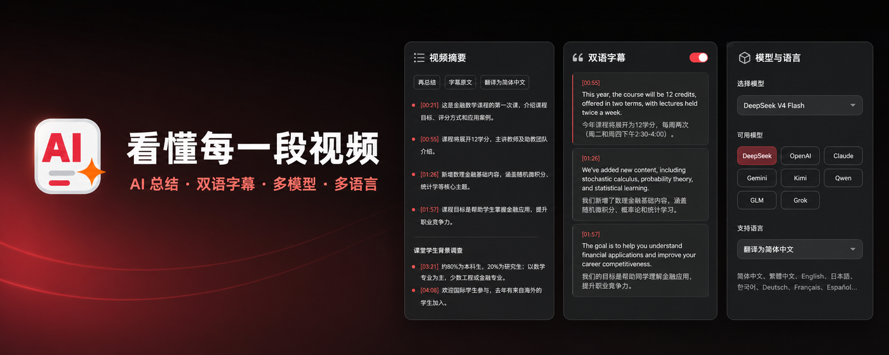
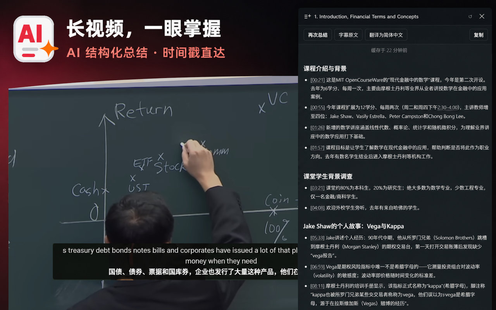
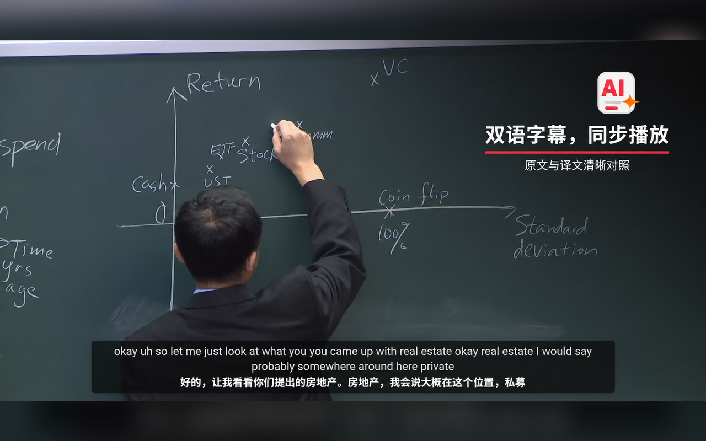
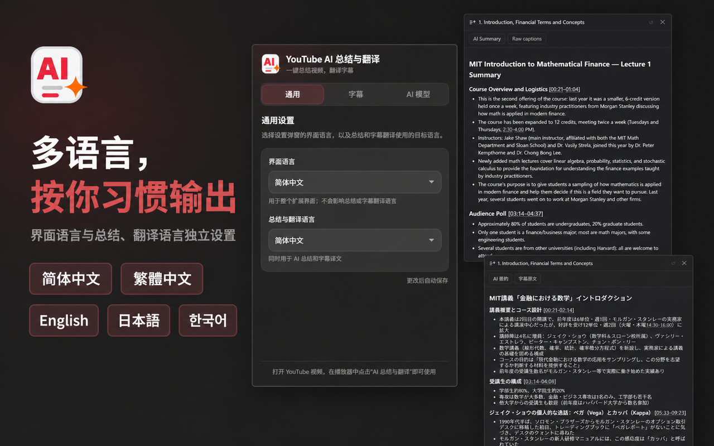
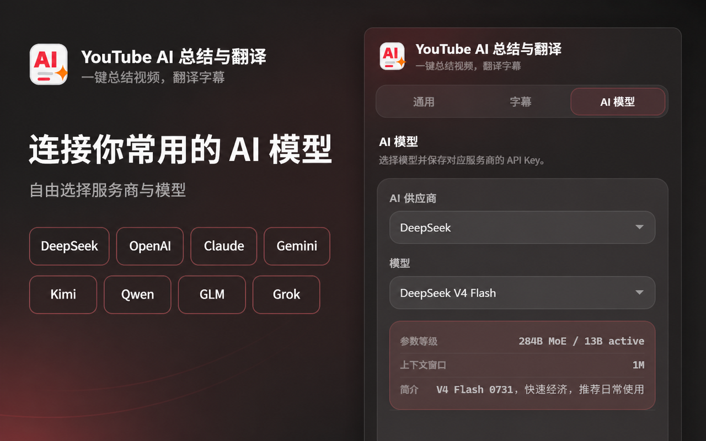

# YouTube AI 总结与翻译

> 简体中文 | [English](README.en.md)

一款用于 YouTube 的 Chrome 扩展。它可以使用你自己的 AI API Key 总结视频内容、阅读和翻译字幕，并在播放器中显示同步双语字幕。

## 功能预览



<p align="center">
  
  
</p>

<p align="center">
  
  
</p>

## 主要功能

### AI 视频总结

- 一键生成结构化的视频内容总结
- 生成过程实时显示，无需等待全部完成
- 支持简体中文、繁体中文、英语、日语、韩语、西班牙语、法语和德语
- 同一视频的总结会保存在本地，方便再次查看

### 字幕阅读与翻译

- 在侧边面板中查看视频完整字幕
- 点击字幕时间戳可直接跳转到对应播放位置
- 支持按段翻译，也可以从当前进度继续翻译全文
- 原文和译文可随时切换

### 播放器双语字幕

- 在 YouTube 播放器内同时显示原文和译文
- 字幕跟随视频时间同步，支持全屏和影院模式
- 字幕文字可以直接框选和复制
- 自动预先翻译即将播放的内容，拖动进度条后会从新位置继续
- 学习模式下，只有鼠标移到字幕上时才显示译文

### 多家 AI 服务可选

支持 DeepSeek、OpenAI、Anthropic Claude、Google Gemini、Moonshot Kimi、通义千问 Qwen、智谱 GLM 和 xAI Grok，并可在扩展设置中切换模型。

你只需要配置其中一家服务商的 API Key。调用产生的费用由对应服务商按照其规则收取。

### 可手动选择设置界面语言

- 设置弹窗支持简体中文、繁体中文、英语、日语和韩语
- 首次使用时根据 Chrome 的界面语言初始化，之后保持你的手动选择
- 界面语言与总结、字幕翻译的输出语言相互独立

## 安装

目前需要以“加载已解压的扩展程序”的方式安装。

### 1. 构建扩展

请先安装 Node.js，然后在项目目录运行：

```bash
npm install
npm run build
```

构建完成后，项目中会生成 `dist` 目录。

### 2. 加载到 Chrome

1. 在 Chrome 地址栏打开 `chrome://extensions`
2. 开启右上角的“开发者模式”
3. 点击“加载已解压的扩展程序”
4. 选择刚刚生成的 `dist` 目录

## 配置

1. 从任意一家受支持的服务商获取 API Key：
   - [DeepSeek](https://platform.deepseek.com/api_keys)
   - [OpenAI](https://platform.openai.com/api-keys)
   - [Anthropic](https://console.anthropic.com/keys)
   - [Google Gemini](https://aistudio.google.com/apikey)
   - [Moonshot Kimi](https://platform.kimi.ai)
   - [通义千问](https://bailian.console.aliyun.com/#/api-key)
   - [智谱 GLM](https://open.bigmodel.cn/usercenter/apikeys)
   - [xAI](https://console.x.ai)
2. 点击 Chrome 工具栏中的扩展图标
3. 按需选择设置弹窗的界面语言，以及总结与翻译的输出语言
4. 选择 AI 服务商和模型
5. 填入对应的 API Key，然后保存

API Key 与服务商一一对应。切换服务商后，需要为新服务商配置相应的 Key。

首次尚未配置当前服务商的 Key 时，扩展弹窗会自动进入“AI 模型”页，并按“选择服务商 → 获取 Key → 粘贴并保存”的步骤引导。服务商和模型会自动保存，API Key 仍需手动确认保存；扩展只检查 Key 是否为空，不会为了验证 Key 主动发起 API 请求。

API Key 仅保存在当前设备，不会通过 Chrome 同步。未配置 Key 时仍可查看和复制字幕原文，但 AI 总结、翻译和播放器双语翻译会保持停用。

## 使用方法

### 总结视频

1. 打开一个带字幕的 YouTube 视频
2. 点击播放器右上角的“AI 总结与翻译”按钮
3. 在右侧面板中选择“AI 总结”
4. 等待总结实时生成

### 阅读或翻译字幕

1. 打开右侧面板中的“字幕原文”
2. 点击时间戳可跳转到对应位置
3. 当字幕语言与目标语言不同时，可选择“翻译本段”或“翻译全文”
4. 使用“原文 / 译文”切换阅读内容

### 开启双语字幕

1. 在播放器原生 CC 按钮旁找到翻译按钮
2. 点击按钮开启或关闭双语字幕
3. 如需减少译文干扰，可在扩展设置中开启学习模式

## 工作原理

扩展的大致处理流程如下：

1. 打开视频后，扩展从 YouTube 页面获取可用字幕，并优先选择合适的字幕语言。
2. 生成总结时，扩展整理带时间信息的字幕，并将内容直接发送给你所选择的 AI 服务商。
3. AI 返回内容时，扩展边接收边显示，因此可以看到总结逐步生成。
4. 翻译字幕时，扩展先在本地整理句子和时间轴，再分段请求 AI 翻译，以尽量保持译文与原字幕一一对应。
5. 播放双语字幕时，扩展根据播放器当前时间显示对应的原文和译文，并提前翻译后续约一分钟的字幕。
6. 总结和翻译结果按视频、模型和目标语言缓存在本地。缓存有效期为 7 天，不同语言的结果互不混用。

如果字幕本身已经是所选目标语言，扩展不会再调用 AI 进行翻译。临时网络错误会自动重试；切换 YouTube 视频时，扩展也会自动识别并更新面板内容。

## 隐私说明

- API Key 仅保存在当前设备的 Chrome 本地存储中
- 视频字幕、生成指令和 API Key 会通过 HTTPS 直接发送给你选择的 AI 服务商，不经过本项目开发者的服务器
- 本地缓存主要用于减少重复请求，可随扩展本地数据一同清除

使用前请同时了解所选 AI 服务商的数据处理政策。更多信息请参阅[隐私政策](https://zwwangcn.github.io/summarize_youtube_plugin/privacy/)。

## 常见问题

### 为什么有些视频无法总结或翻译？

扩展需要先获取视频字幕。视频没有字幕、字幕受限，或 YouTube 暂时无法提供字幕时，相关功能可能不可用。

### 为什么双语字幕刚开启时没有立即显示译文？

首次翻译需要请求 AI 服务。译文生成后会显示并保存到本地，之后再次播放相同片段通常会更快。

### 为什么需要自己提供 API Key？

扩展直接使用你选择的 AI 服务，不设置统一的中转服务器。这样可以自由选择服务商和模型，但相应的 API 用量及费用由你的服务商账户承担。

## License

[MIT](LICENSE)
